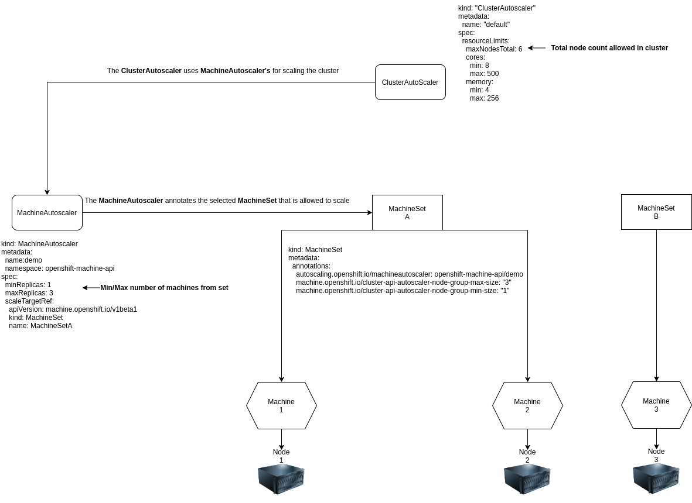

Machine Auto-Scaling
=========

Auto-scaling the OpenShift cluster is done by the ClusterAutoscaler Operator. This operator works with a CRD called ClusterAutoscaler that we need to create and deploy into our cluster.

Once this CRD has been created, the operator will detect it and start looking for pods that cannot be scheduled due to a lack of current resources.

The ClusterAutoscaler uses MachineAutoscaler's to actually scale up the machines (nodes). This means that to set up a OpenShift cluster that automaticially scales up or down, it needs to be using machines and we need to configure both the ClusterAutoscaler as well as MachineAutoscaler's for each machineset we want.

## Overview


# Explaination of the relationship between the various resources used in cluster autoscaling.

More reading can be done here:

https://docs.openshift.com/container-platform/4.7/machine_management/applying-autoscaling.html

Step 1 - Creating the ClusterAutoscaler
------------
First we will be creating our ClusterAutoscaler.

`oc project openshift-machine-api`

`oc apply -f clusterautoscaler.yaml`

> **Important**: In the Cluster Autoscaler resource, we define a max amount of nodes. This node count includes control plane node, aka masters. Therefore in this demo we are setting it to 6. This means that the cluster can house a maximum of 6 nodes. Three masters and three workers.


Step 2 - Creating the MachineAutoscaler
------------
Now that we have our ClusterAutoscaler set, we need to create a MachineAutoscaler for it work with.

* Choose a machineset `oc get machineset`
* Edit the machineautoscaler.yaml file with the correct name
* `oc apply -f machineautoscaler.yaml`

The machine autoscaler configuration we have applied, sets the maximum amount of replicas for that machineset to 3. Meaning that it can only scale up to a total maximum of 3 nodes.
This process will have created another pod in the openshift-machine-api namespace

When creating a Machine autoscaler, annotations will appear on the machineset that was used. The Cluster autoscaler uses these annotations in order to know which machineset it is allowed to scale. 

Step 3 - Scaling the cluster
------------
In order for us to scale the cluster, we need to ensure that we have pods that are not able to deploy due to a lack of resources.

To more easily ensure this, you can start of by lowering the amount of available resources by scaling down the machinesets that was not used when creating the Machine Autoscaler.

* `oc get machinesets`
* `oc scale machinesets <NAME> <NAME2> --replicas=0`

In order to follow along, open another terminal and look at the logs from the new pod that was created during the last step in openshift-machine-api.

`oc logs -f <NAME>`

Let it run while we create some load on the cluster.


Step 4 - Generate load
------------
In order to get the Cluster Autoscaler to provision new nodes for us, we need to generate some load in the cluster.

Open a new terminal and create a namespace to host our load:

`oc new-project auto-scale`

Apply the load:

```
for i in {1..25}; do
sed s/change/$i/ load.yaml | oc create -f -
done
```
